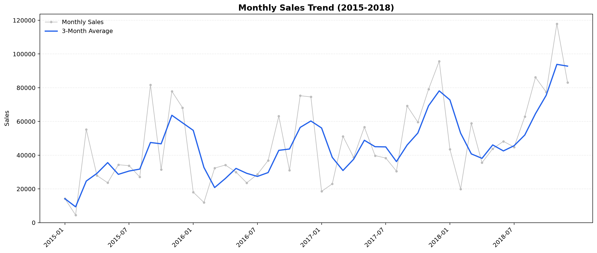
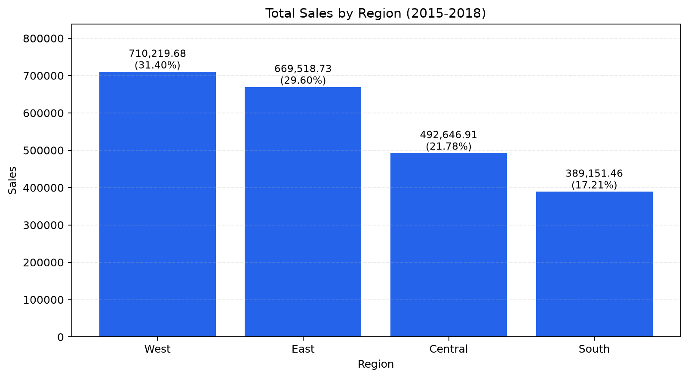
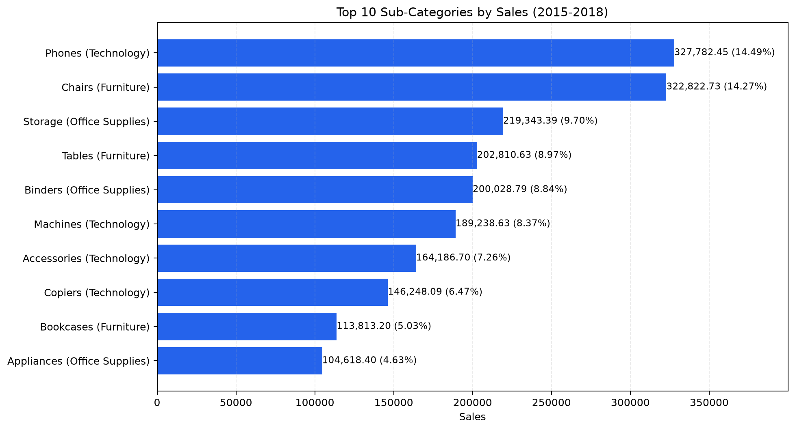
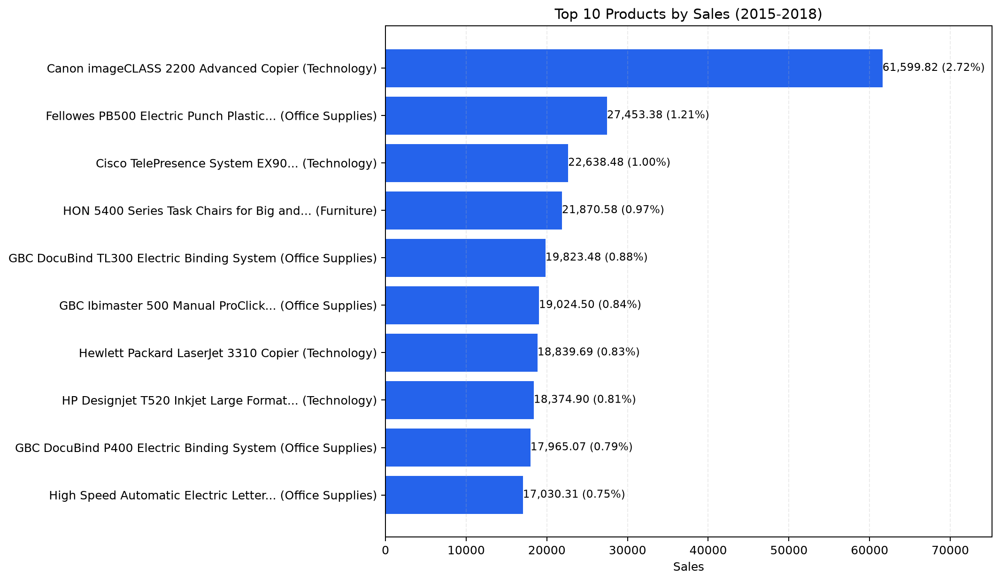
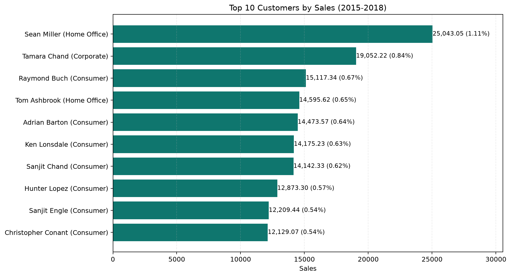
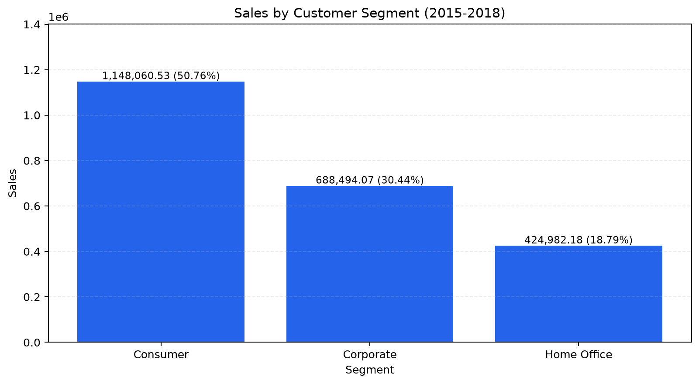
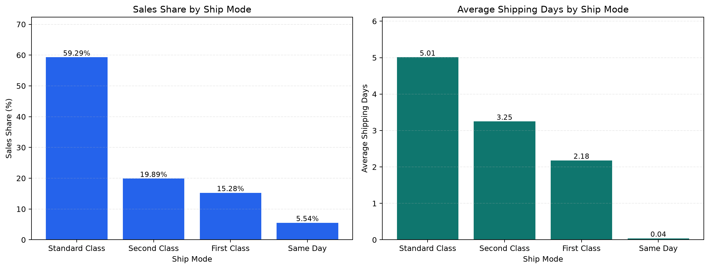
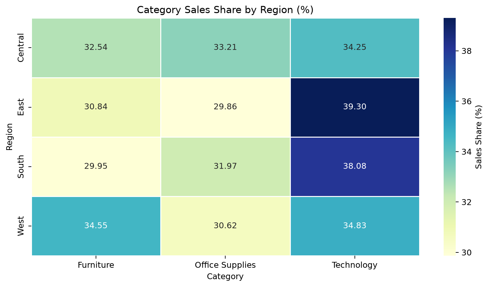

# Superstore Sales Analysis

基于 kaggle 的 Superstore 销售数据的探索性分析项目，使用 Python、pandas、Matplotlib 和 Seaborn，对 2015 至 2018 年的销售趋势、地区、品类、产品、客户和配送表现进行分析。

## 项目目标

本项目希望回答以下问题：

- 销售额随时间怎么变化？
- 哪些地区和品类贡献的销售额最高？
- 哪些产品和客户贡献了主要销售额？
- 不同客户群体和配送方式的表现有什么差异？
- 不同地区的品类销售结构是否存在差异？

## 数据

- 数据覆盖时间：2015-01 至 2018-12
- 数据规模：9800行、18个字段
- 唯一订单数：4922
- 唯一客户数：793
- 原始数据位置：'data/raw/train.csv'
- 数据来源：Kaggle 下载的 Superstore Sales Dataset

数据中没有利润、成本、折扣、数量和退货等字段，因此本项目主要分析销售额和订单结构，不分析盈利能力。

## 工具

- Python
- pandas
- Matplotlib
- Seaborn
- Jupyter Notebook
- VS Code

## 项目结构

```text
superstore-sales-analysis/
├── data/
│   ├── raw/
│   │   └── train.csv
│   └── processed/
├── notebooks/
│   └── analysis.ipynb
├── images/
│   ├── monthly_sales.png
│   ├── region_sales.png
│   ├── top10-subcategory_sales.png
│   ├── top10_products.png
│   ├── top10_customers.png
│   ├── sales_by_segment.png
│   ├── shipping_mode_summary.png
│   └── region_category_share.png
├── README.md
└── requirements.txt
```

## 主要发现

- 2015 至 2018 年销售额整体呈现波动上升趋势。
- 2018-11 销售额最高，2015-02 销售额最低。
- West 和 East 是销售额最高的两个地区，合计贡献约 61% 的销售额。
- Technology、Furniture 和 Office Supplies 的销售占比较为接近。
- 前 10 名产品销售额合计占约 10.82%，前 10 名客户销售额合计占约 6.80%，销售分布较分散。
- Consumer 是销售额最高的客户群体，占 50.76%。
- Standard Class 贡献了约 59.29% 的销售额，但平均配送时间最长。
- East 和 South 更偏向 Technology，West 的 Furniture 占比较高。

## 效果预览

### 月度销售趋势



### 地区销售表现



### 子品类销售表现



### 产品与客户表现




### 客户群体表现


### 配送方式表现


### 地区与品类交叉分析


## 主要建议

- 保持三个主要品类的销售结构平衡，同时关注 Phones、Chairs、Storage 等表现较强的子品类。
- 根据地区差异调整品类重点，但需要成本数据进一步验证。
- 维护 Consumer 主要客户群体，并继续研究 Corporate 和 Home Office 的购买偏好。
- 结合配送成本评估不同配送速度服务的价值。
- 补充利润和成本数据后再制定盈利策略。

## 如何运行

创建虚拟环境：

```powershell
python -m venv .venv
```

安装依赖：

```powershell
.\.venv\Scripts\python.exe -m pip install -r requirements.txt
```

在 VS Code、PyCharm 或 Jupyter 中打开：

```text
notebooks/analysis.ipynb
```

选择 `.venv` 内核，然后执行 `Restart Kernel and Run All`。

## 项目限制


- 数据没有 Profit、Cost、Discount、Quantity 和 Returns 字段。
- 无法分析利润率、成本效率和折扣影响。
- 无法判断哪种产品、客户群体或配送方式最赚钱。
- 观察到的差异属于描述性分析，不能直接解释为因果关系。
- 数据覆盖时间为 2015 至 2018 年，结论不能直接代表更晚时期。

## 后续改进

- 补充利润和成本数据，计算利润率。
- 补充折扣和退货数据，分析促销和退货对销售的影响。
- 对客户进行分群和复购分析。
- 评估不同配送方式的成本和时效。
- 在数据质量稳定后尝试销售额预测。